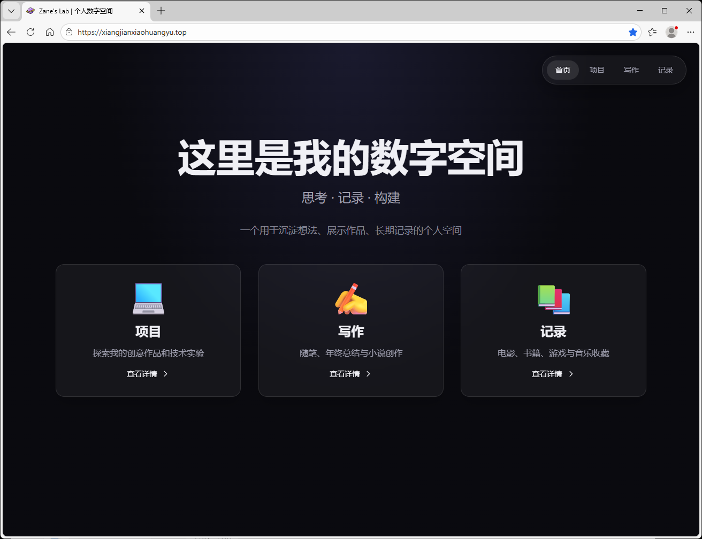
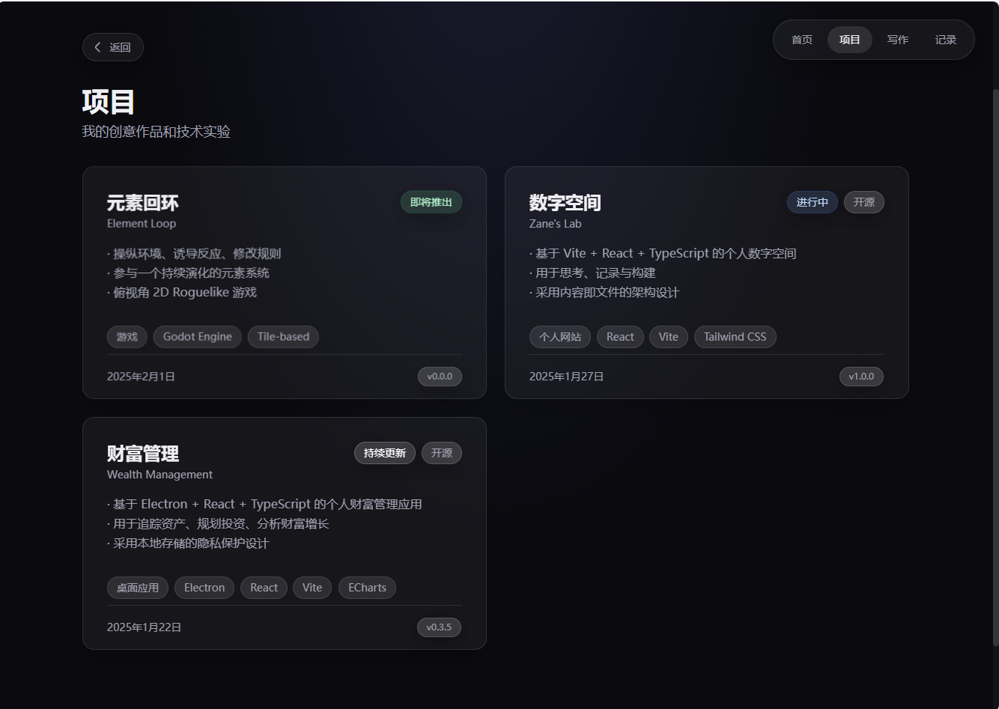
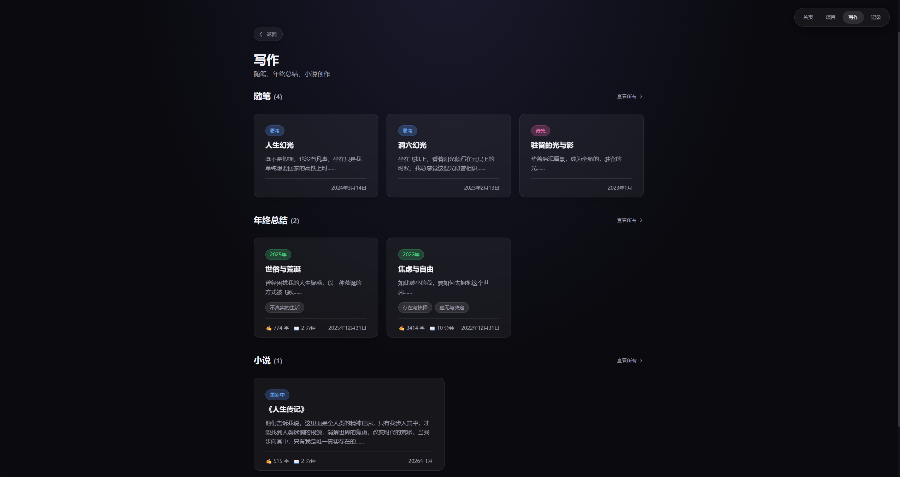
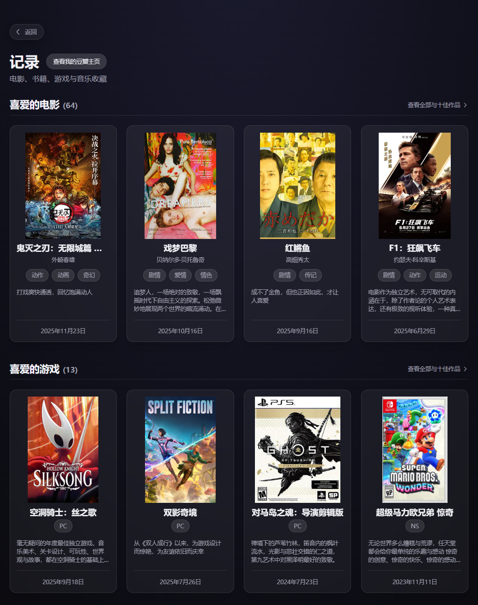
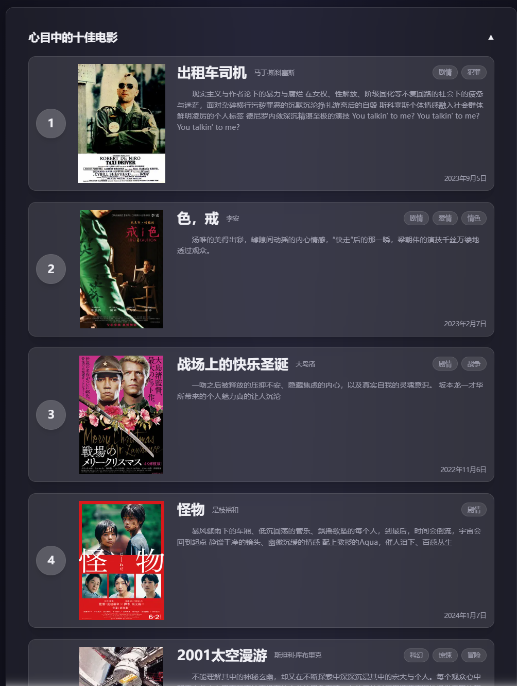
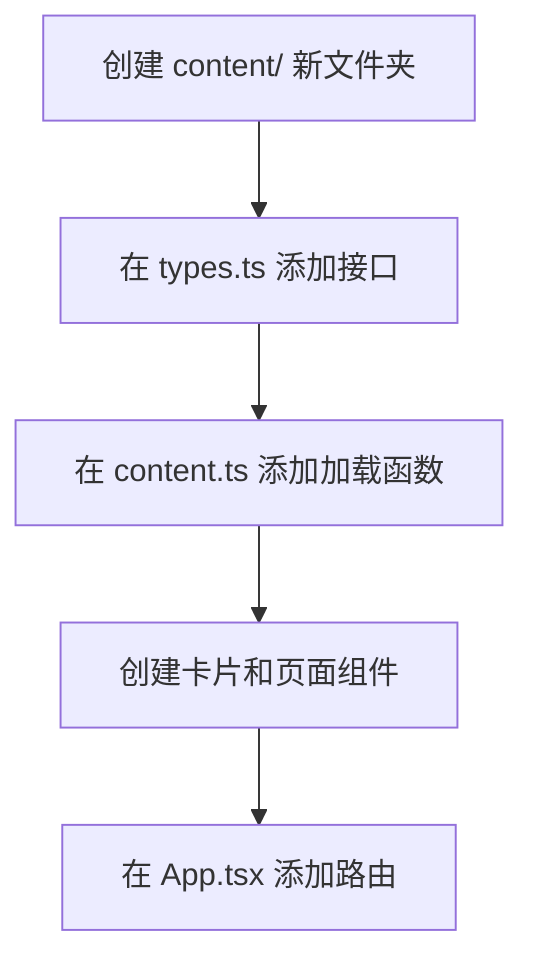

<div align="center">

# 🌌 Zane's Lab

### **一个用于思考、记录与构建的个人数字空间**

[](https://xiangjianxiaohuangyu.top/)
[](https://opensource.org/licenses/MIT)
[](https://react.dev/)
[](https://www.typescriptlang.org/)
[](https://vitejs.dev/)

</div>

---

## ✨ 项目概述

这是我的个人网站，采用 **内容即文件** 的架构设计，用于系统性展示项目成果、文字创作与长期记录内容。

🌐 **在线访问**: [https://xiangjianxiaohuangyu.top](https://xiangjianxiaohuangyu.top)

### 核心特点

| 特点 | 说明 |
|:---:|:---|
| 📖 **可阅读** | 优雅的排版，舒适的阅读体验 |
| 🔧 **可扩展** | 添加内容无需修改代码 |
| 🛠️ **可维护** | 清晰的结构，类型安全 |
| 🌱 **可持续** | 长期演进，自然生长 |

---

## 🎨 设计风格

采用**玻璃拟态（Glassmorphism）**设计风格，营造现代、优雅的视觉体验：

- 🪟 半透明卡片
- 🔮 背景模糊（backdrop-filter）
- ✨ 柔和边框与轻微高光
- 🌑 深色背景 + 浅色内容

---

## 📸 界面预览

### 首页 - Hero 区域
欢迎页面，展示个人介绍与导航入口



### 项目展示页
系统性展示个人项目成果



### 写作空间
随笔、年终总结、小说创作



### 记录分类
电影、书籍、游戏、音乐记录



### 详情页面
优雅的阅读体验，丰富的内容展示



---

## 🛠️ 技术栈

```
📦 构建工具    Vite 6.x
⚛️ 框架        React 18.x + TypeScript 5.x
🚦 路由        React Router DOM 6.x
🎨 样式        Tailwind CSS 3.x
📝 Markdown    gray-matter + remark
☁️ 部署        Cloudflare Pages
```

---

## 🚀 快速开始

### 安装依赖

```bash
npm install
```

### 启动开发服务器

```bash
npm run dev
```

访问 http://localhost:3000

### 构建生产版本

```bash
npm run build
```

### 预览生产构建

```bash
npm run preview
```

---

## 📁 项目结构

```
Zane-lab/
├── content/                  # 📄 内容数据（.md 文件）
│   ├── projects/             # 🚀 项目展示
│   ├── writing/              # ✍️ 写作内容
│   │   ├── essays/           #    随笔
│   │   ├── annual/           #    年终总结
│   │   └── fiction/          #    小说
│   └── records/              # 📚 个人记录
│       ├── movies/           #    电影
│       ├── books/            #    书籍
│       ├── games/            #    游戏
│       └── music/            #    音乐
├── public/                   # 🖼️ 静态资源
├── src/
│   ├── components/           # ⚛️ React 组件
│   │   ├── layout/           #    布局组件
│   │   ├── cards/            #    卡片组件
│   │   ├── sections/         #    页面区块
│   │   └── ui/               #    基础 UI 组件
│   ├── lib/                  # 🔧 核心工具库
│   ├── pages/                # 📄 页面组件
│   └── styles/               # 🎨 样式文件
├── index.html
├── package.json
├── vite.config.ts
├── tailwind.config.js
└── tsconfig.json
```

---

## 📝 添加内容

### 🚀 添加项目

1. 在 `content/projects/` 创建新的 `.md` 文件
2. 添加 Frontmatter：

```yaml
---
title: "项目标题"
description: "项目简述"
date: "2025-01-27"
tags: ["React", "TypeScript", "Tailwind"]
status: "completed"  # completed | in-progress | planned
---

# 项目标题

详细的项目介绍...

## 技术栈

- React
- TypeScript
```

3. ✅ 完成！项目会自动出现在列表页

---

### ✍️ 添加写作

1. 在对应分类目录创建文件：
   - `content/writing/essays/` - 随笔
   - `content/writing/annual/` - 年终总结
   - `content/writing/fiction/` - 小说

2. 添加 Frontmatter：

```yaml
---
title: "文章标题"
description: "文章简介"
date: "2025-01-27"
category: "essay"  # essay | annual | fiction
tags: ["思考", "生活"]
readTime: 5  # 阅读时长（分钟）
---

文章内容...
```

3. ✅ 完成！

---

### 📚 添加记录

1. 在对应分类目录创建文件：
   - `content/records/movies/` - 电影
   - `content/records/books/` - 书籍
   - `content/records/games/` - 游戏
   - `content/records/music/` - 音乐

2. 添加 Frontmatter：

```yaml
---
title: "作品标题"
category: "movie"  # movie | book | game | music
date: "2025-01-27"
rating: 8  # 评分 1-10
tags: ["科幻", "经典"]
director: "导演名"  # 电影专用
notes: "个人感想"
---

记录内容...
```

3. ✅ 完成！

---

## 🔑 核心文件说明

### 内容系统

| 文件 | 说明 |
|:---|:---|
| **[src/lib/types.ts](src/lib/types.ts)** | TypeScript 类型定义，定义所有 Frontmatter 接口 |
| **[src/lib/markdown.ts](src/lib/markdown.ts)** | Markdown 解析工具，转换 .md 文件为 HTML |
| **[src/lib/content.ts](src/lib/content.ts)** | **核心文件**，使用 Vite glob 加载所有内容 |

### 组件系统

| 组件 | 说明 |
|:---|:---|
| **[src/components/ui/GlassCard.tsx](src/components/ui/GlassCard.tsx)** | 玻璃拟态卡片组件 |
| **[src/components/layout/Header.tsx](src/components/layout/Header.tsx)** | 顶部导航栏 |
| **[src/components/cards/ProjectCard.tsx](src/components/cards/ProjectCard.tsx)** | 项目卡片 |
| **[src/components/sections/Hero.tsx](src/components/sections/Hero.tsx)** | 首页欢迎区 |

### 页面路由

```
/            → 首页
/projects    → 项目列表
/writing     → 写作分类
/records     → 记录分类
```

---

## 💡 设计理念

### 架构原则

1. **内容即文件** (Content as Files) - 所有内容存储为 .md 文件
2. **分类即目录** (Categories as Folders) - 通过文件夹组织内容
3. **页面即模板** (Pages as Templates) - 组件渲染内容，不包含业务逻辑
4. **零代码添加内容** - 添加新内容只需新增 .md 文件

### 设计目标

- **内容驱动** - 而非视觉驱动
- **为内容服务** - 为长期积累服务
- **克制、简约、大气** - 理性、安静的设计风格

---

## 🌐 部署

### Cloudflare Pages 部署

1. 连接 GitHub 仓库到 Cloudflare Pages
2. 配置构建设置：
   - **Build command**: `npm run build`
   - **Build output directory**: `dist`
3. ✅ 自动部署

### 环境变量

无需配置环境变量，开箱即用。

---

## 👨‍💻 开发说明

### 添加新功能

扩展架构设计：



### 样式定制

编辑以下文件：
- **[src/styles/index.css](src/styles/index.css)** - 全局样式
- **[src/styles/glassmorphism.css](src/styles/glassmorphism.css)** - 玻璃拟态样式
- **[tailwind.config.js](tailwind.config.js)** - Tailwind 配置

---

## 📄 许可证

MIT License

---

<div align="center">

**思考记录，持续构建。**

Made with 🧠 by Zane

</div>
